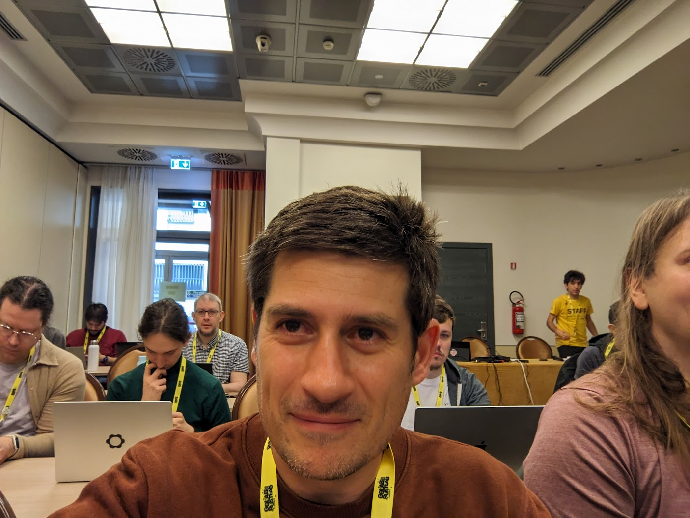

class: center, middle

# Rustlab 2024 à Florence

---

Conférence rust à Florence 🌞
---

Workshop 1


```rust
fn main() {
    println!("Hello, world!");
}
```

.right[Right-aligned text]

# Images

.right[]


---

.right]

---

## Build a Ray Tracer with Rust and wgpu

Présenté par Niklaz Kloz


- wgpu : successeur de WebGL

- pas de shaders

- langage de shader : mélange de TypeScript et Rust


A emporter
---

- j'ai vu beaucoup de gens sur NixOs
- des gens sur Wayland
- des mac qui donnent envie
- partager
  - blogs
  - crates
- fier des crustaces
- le monde est à portée de main
- Rust is a bright future !
